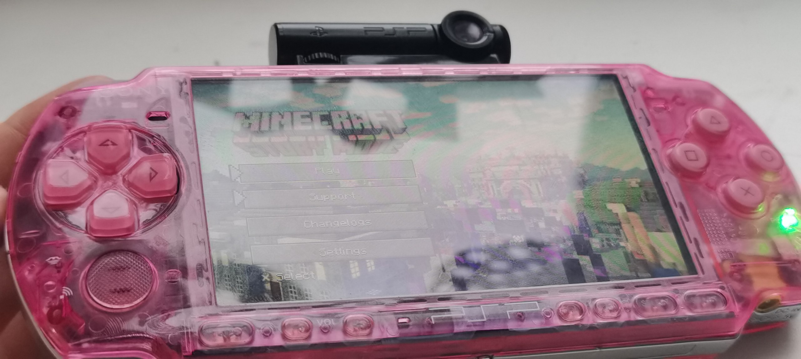
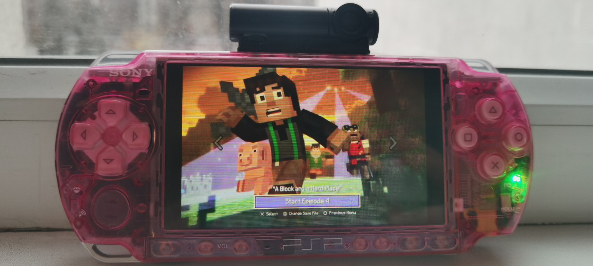
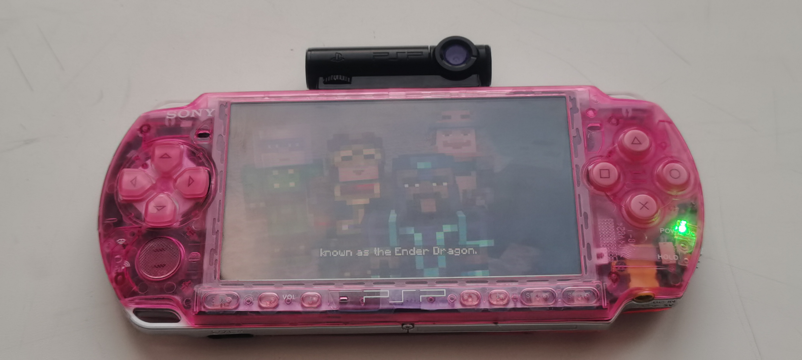

# Minecraft Story Mode Portable (PSP)

### [english readme version / английская версия readme](./README.md)

Порт Minecraft Story Mode: Сезон 1 для PSP.

Это фанатский порт Minecraft: Story Mode.
Этот порт не связан с Telltale Games или Netflix.
Оригинальная игра и версия Netflix больше недоступны, но игра всё ещё стоит того, чтобы её попробовать!

  
  

  
  

## 🪞 зеркала репозитория

* codeberg -> [https://codeberg.org/entitybtw/mcsm_portable](https://codeberg.org/entitybtw/mcsm_portable)
* gitlab -> [https://gitlab.com/entitybtw-group/mcsm_portable](https://gitlab.com/entitybtw-group/mcsm_portable)

## 👏 спасибо

* **pox1016**: За адаптацию Minecraft Story Mode Netflix Interactive для YouTube.
* **Antim**: За кучу советов и исправление багов.
* **dntrnk**: За улучшения меню и большие оптимизации.

Спасибо за поддержку проекта! Вы можете вносить свой вклад или сообщать о любых проблемах. 🚀
